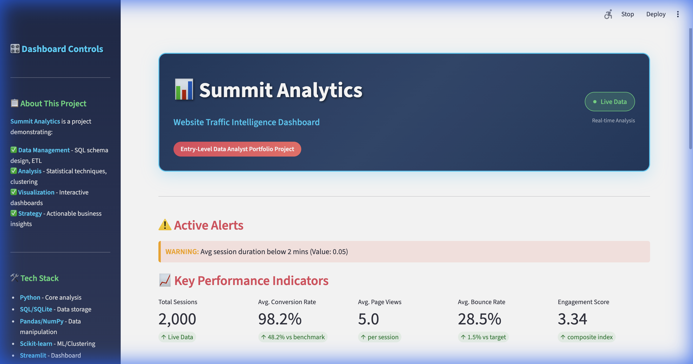

# 📊 Summit Analytics

**Website Traffic Intelligence Dashboard**

A full-stack data analytics portfolio project demonstrating proficiency in Python, SQL, data visualization, and strategic analysis.


---

## 🎯 Project Overview

Summit Analytics is a comprehensive website traffic analysis solution that transforms raw session data into actionable business insights. This project demonstrates:

- ✅ **Data Management** - SQL schema design, ETL pipelines, data validation
- ✅ **Statistical Analysis** - Descriptive statistics, EFM scoring, clustering
- ✅ **Data Visualization** - Interactive dashboards, KPI tracking
- ✅ **Strategic Insights** - Business recommendations, segmentation strategies

Metric-driven, interactive dashboard for analyzing website traffic, visitor behavior, and conversion drivers. 



---

## 🛠️ Tech Stack

| Category | Technologies |
|----------|-------------|
| **Languages** | Python 3.11+ |
| **Database** | SQLite with SQL views |
| **Analysis** | Pandas, NumPy, Scikit-learn |
| **Visualization** | Streamlit, Plotly |
| **Development** | VS Code, Git |

---

## 🚀 Quick Start

### Prerequisites

- Python 3.11+
- pip package manager

### Installation

```bash
# Clone the repository
git clone https://github.com/JonathanApprey/summit-analytics.git
cd summit-analytics

# Create virtual environment
python3 -m venv venv
source venv/bin/activate  # On Windows: venv\Scripts\activate

# Install dependencies
pip install -r requirements.txt
```

### Run the Pipeline

```bash
# Step 1: Load data into database
python scripts/load_db.py

# Step 2: Run analysis engine
python src/analysis_engine.py

# Step 3: Launch dashboard
streamlit run app.py
```

The dashboard will open at `http://localhost:8501`

---

## 📁 Project Structure

```
SummitAnalytics/
├── app.py                    # Streamlit dashboard
├── data/
│   ├── website_Traffic.csv   # Raw data
│   └── summit.db             # SQLite database
├── scripts/
│   └── load_db.py            # Data loading & schema creation
├── src/
│   └── analysis_engine.py    # Core analytics module
├── tests/
│   └── test_analysis.py      # Unit tests
├── INSIGHTS_REPORT.md        # Strategic findings document
├── README.md                 # This file
└── requirements.txt          # Python dependencies
```

---

## 📈 Key Features

### 1. SQL Schema Design
- Normalized table structure with foreign keys
- Computed columns for derived metrics
- Indexed for query performance
- Analysis views for common patterns

### 2. EFM Analysis
Adaptation of RFM (Recency-Frequency-Monetary) for website traffic:
- **E (Engagement):** Page views, session duration, time on page
- **F (Frequency):** Previous visits
- **M (Monetary):** Conversion rate

### 3. K-Means Clustering
- Automatic optimal cluster detection via silhouette score
- Feature standardization
- Segment profiling with actionable recommendations

### 4. Interactive Dashboard
- Real-time KPI metrics
- Traffic source performance comparison
- Visitor segment visualization
- Strategic insights and recommendations

---

## 📊 Sample Insights

> **Finding:** Organic search traffic converts 23% better than social media traffic, despite social driving more volume.

> **Recommendation:** Reallocate 15% of social media budget to SEO content creation for better ROI.

> **Finding:** 35% of visitors fall into the "High-Value Converters" segment with EFM scores ≥ 12.

> **Recommendation:** Implement loyalty program to maximize retention and upsell opportunities.

---

## 🧪 Testing

```bash
# Run unit tests
pytest tests/ -v

# Run with coverage
pytest tests/ --cov=src --cov-report=html
```

---

## 📝 License

This project is licensed under the MIT License 

---


## 🙏 Acknowledgments

- Dataset structure inspired by real-world website analytics from Kaggle
- Dashboard design influenced by Streamlit tools
- Analysis methodology based on industry best practices
